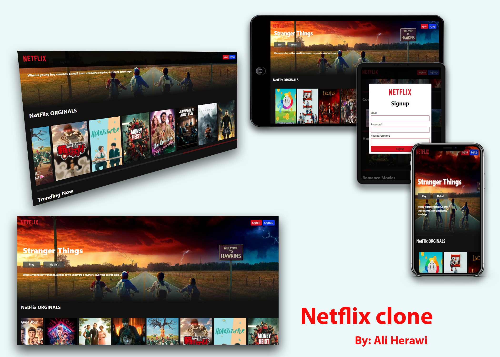

# React Netflix-Clone  
 React Netflix clone developed and built with React (v17.0.2). for styles is used pure css.
 I'm exited to share this Netflix-clone with you and looking forward for your feedback [**in here my Linkein post**](https://www.linkedin.com/posts/ali.herawi)

 # Demo
 Visit: [Project React Netflix clone demo](https://netflix-clone-af.netlify.app/)

# features
* Full Responsive
* working with api
* get data from The Movie Database(tmdb)
* react-youtube
* movie-trailer
* react-transition-group
* animations

# getting started

**1. clone from Github**
 `git clone https://github.com/Aliherawi7/Netflix-Af-clone.git`

**2. Run `npm install`**

# Would you like to help and support me?
* Star Github repository
* ...
